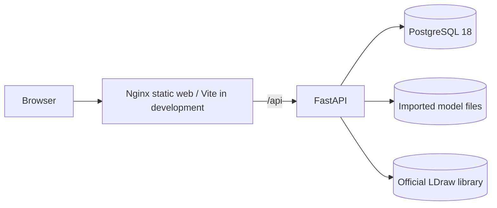

# Bricky

Bricky is a local-first LEGO parts workspace that imports LDraw models, preserves their source, derives physical bills of materials, tracks personal inventory, and calculates exact build readiness without cloud services.

It is deliberately small enough to run on one workstation, but it applies production-oriented boundaries: PostgreSQL owns durable metadata, imported files are immutable, rebuildable catalog data is isolated from personal data, and operational work is explicit.

## Portfolio preview

Screenshot slots are documented in [`docs/assets/README.md`](docs/assets/README.md). Recommended captures are the catalog viewer, model build-readiness view, missing-parts view, and local service overview. Screenshots are intentionally not fabricated or committed as placeholders.

For a concise presentation flow, use [`docs/DEMO.md`](docs/DEMO.md).

## Capabilities

- Install and serve the official LDraw Parts Library locally.
- Transactionally index searchable part/color metadata in PostgreSQL.
- Render official parts and imported LDR/MPD models with lazy-loaded Three.js.
- Navigate authored LDraw building steps.
- Track exact part/color inventory quantities in one hidden local workspace.
- Import LDR/MPD sources up to a configurable limit and preserve original bytes.
- Recursively resolve embedded MPD submodels, repeated quantities, and color inheritance.
- Diagnose MPD source definitions and bounded hierarchical instruction occurrences without changing viewer playback.
- Canonicalize validated official LDraw `Moved to` aliases during new imports.
- Compare model BOM rows with current inventory by exact canonical part and physical color.
- Derive build readiness and missing-parts views without persisted wishlist data.
- Create and restore checksummed local backups of PostgreSQL and imported originals.
- Run either a hot-reloading development stack or a production-like Nginx stack.

## Architecture



Development publishes Vite on `127.0.0.1:5173` and FastAPI on `127.0.0.1:8000`. Production-like mode publishes only Nginx on `127.0.0.1:8080` by default; API and PostgreSQL remain internal Compose services.

See [`docs/ARCHITECTURE.md`](docs/ARCHITECTURE.md) for service boundaries, storage ownership, data classification, import/coverage flows, and the multiuser scaling path.
The phase-one MPD graph design, supported subset, fixtures, and diagnostics are documented in [`docs/INSTRUCTION_GRAPH.md`](docs/INSTRUCTION_GRAPH.md).

## Technology choices

| Area | Stack | Reason |
|---|---|---|
| Frontend | React 19, strict TypeScript, Vite | Small typed UI with fast local iteration and route-level code splitting. |
| 3D | Three.js, React Three Fiber | Browser-side LDraw rendering without generated GLB assets. |
| API | Python 3.13, FastAPI, Pydantic | Explicit typed HTTP contracts and testable service logic. |
| Persistence | PostgreSQL 18, SQLAlchemy 2, Alembic | Durable relational constraints, transactional rebuild/import behavior, portable dumps. |
| Packaging | Docker Compose, multi-stage images, Nginx | No host runtimes; reproducible development and production-like operation. |
| Quality | Pytest, Vitest, TypeScript compiler | Deterministic backend, API, parser, coverage, backup, and frontend helper checks. |

Docker Engine with Docker Compose support is the only host application dependency. Linux shell utilities such as `sh`, `date`, and `sha256sum` are used by operational scripts.

## Environment

Create the local environment file:

```sh
cp .env.example .env
```

The checked-in values are convenient local-development defaults, not public-deployment credentials. Replace `POSTGRES_PASSWORD` before exposing any environment outside a trusted workstation.

On Linux, set `LOCAL_UID` and `LOCAL_GID` to the numeric result of `id -u` and `id -g`. This keeps `data/ldraw`, `data/models`, and `data/backups` readable and removable by the host user without world-writable permissions.

If an older checkout created root-owned model files, repair ownership once:

```sh
docker compose run --rm --no-deps --user root api \
  sh -c 'chown -R "$LOCAL_UID:$LOCAL_GID" /data/models'
```

## Development setup

Start the hot-reloading stack:

```sh
docker compose up --build
```

Or start it detached through the convenience script:

```sh
./scripts/dev-up.sh
```

Vite and Uvicorn reload from bind-mounted source. Local URLs:

- Overview: <http://127.0.0.1:5173/>
- Catalog: <http://127.0.0.1:5173/catalog>
- Inventory: <http://127.0.0.1:5173/inventory>
- Models: <http://127.0.0.1:5173/models>
- Viewer fixture: <http://127.0.0.1:5173/viewer-demo>
- Direct development API health: <http://127.0.0.1:8000/api/health>

### First-time database and LDraw setup

Migrations, library installation, and catalog indexing are intentionally explicit:

```sh
docker compose run --rm api alembic upgrade head
docker compose run --rm api python -m app.cli.ldraw_library status
docker compose run --rm api python -m app.cli.ldraw_library install
docker compose exec api python -m app.cli.ldraw_catalog status
docker compose exec api python -m app.cli.ldraw_catalog rebuild
```

An existing archive can be installed without network access:

```sh
docker compose run --rm api python -m app.cli.ldraw_library install \
  --archive /data/ldraw/complete.zip
```

The installer verifies SHA-256, rejects unsafe archives, preserves upstream attribution, and atomically installs under `data/ldraw/official`. Normal application startup never downloads or updates the library.

## Production-like local operation

Production uses [`compose.prod.yaml`](compose.prod.yaml):

```text
browser -> Nginx :8080 -> FastAPI :8000 -> PostgreSQL :5432
```

Only `127.0.0.1:${PROD_WEB_PORT}` is published. Nginx serves fingerprinted static assets with immutable caching, uses no-cache behavior for `index.html`, supports React Router fallback, proxies `/api/`, applies basic security headers, and returns a JSON 503 when the API is unavailable.

For a configured database, start the stack with:

```sh
./scripts/prod-up.sh
# Equivalent:
docker compose -f compose.prod.yaml up --build -d
```

For a new production-like checkout, use this explicit sequence:

```sh
docker compose -f compose.prod.yaml build
docker compose -f compose.prod.yaml up -d db
docker compose -f compose.prod.yaml run --rm api alembic upgrade head
docker compose -f compose.prod.yaml run --rm api python -m app.cli.ldraw_library status
docker compose -f compose.prod.yaml run --rm api python -m app.cli.ldraw_library install
docker compose -f compose.prod.yaml run --rm api python -m app.cli.ldraw_catalog status
docker compose -f compose.prod.yaml run --rm api python -m app.cli.ldraw_catalog rebuild
docker compose -f compose.prod.yaml up -d
```

The API runs without reload and uses `API_WORKERS` (default `2`). Nginx and the API run as non-root users. No entrypoint applies migrations, downloads LDraw, or rebuilds the catalog.

Useful operations:

```sh
docker compose -f compose.prod.yaml ps
./scripts/logs.sh --prod
./scripts/prod-down.sh
```

Shutdown preserves PostgreSQL and bind-mounted data. Never add `--volumes` unless permanent deletion is intended.

## Backup and restore

Backups are written under ignored `data/backups/`. The default archive contains:

- `bricky-backup/manifest.json` with format version and UTC creation time;
- `bricky-backup/database.dump`, a portable PostgreSQL custom-format dump;
- `bricky-backup/models/`, including immutable imported originals;
- SHA-256 and byte size for every payload.

The default backup excludes `.env`, credentials, generated builds, and the reinstallable official LDraw library.

Create a development or production-like backup:

```sh
./scripts/backup.sh
./scripts/backup.sh --prod
```

The script requires a running database and briefly pauses running API/web services so the database dump and model files cannot diverge through application writes. PostgreSQL provides a transactionally consistent dump; direct out-of-band filesystem/database changes are not coordinated.

Validate an archive without restoring it:

```sh
docker compose run --rm --no-deps api \
  python -m app.cli.backup validate /data/backups/bricky-TIMESTAMP.tar.gz
```

Restore replaces the current PostgreSQL database and all imported model files. Create a current backup first, then use the deliberate confirmation flag:

```sh
./scripts/restore.sh --force data/backups/bricky-TIMESTAMP.tar.gz
./scripts/restore.sh --prod --force data/backups/bricky-TIMESTAMP.tar.gz
```

Restore rejects unknown formats, invalid manifests/checksums, links, traversal paths, archives outside `data/backups`, and calls without `--force`. It applies current migrations after database restore but does not download LDraw. The final status output reports whether the library is missing or catalog rebuilding is required.

For high-confidence testing, restore into a disposable Compose project and alternate `MODEL_DATA_PATH`/`BACKUP_DATA_PATH`, verify inventory/model/source bytes, then remove that project and its volume. Never test destructive restore against the only copy of personal data.

## Tests and quality checks

With `.env` present, the full convenience check starts required development services and runs all checks:

```sh
./scripts/check.sh
```

Equivalent commands:

```sh
docker compose config
docker compose exec -T api pytest -q
docker compose exec -T web npm run test
docker compose exec -T web npm run typecheck
docker compose exec -T web npm run build
```

Tests use synthetic schemas, libraries, archives, and model sources. They do not require or modify the real installed LDraw library or personal runtime data.

## Data model and persistence

PostgreSQL is the source of truth for catalog metadata, the hidden `local-default` workspace, inventory, imported model records, BOM rows, import issues, and catalog fingerprints.

The official catalog is rebuildable. Inventory and model BOM rows use stable natural LDraw identifiers rather than destructive foreign keys to catalog tables, so catalog rebuilds preserve personal state. Imported originals under `data/models` are required for later rendering and source download.

Data deletion warnings:

- `docker compose down` preserves database and files.
- `docker compose down --volumes` permanently deletes PostgreSQL-backed inventory and model metadata.
- Deleting `data/models` leaves corresponding database records unable to render.
- Delete models through the UI/API to remove metadata and managed files together.
- Deleting `data/ldraw` removes the official library; it can be explicitly reinstalled and reindexed.

## LDraw import behavior

Supported uploads are `.ldr` and `.mpd`, up to 25 MiB by default. LDR normally represents one model. MPD is preferred for projects with embedded submodels because external sibling LDR files and ZIP projects are not resolved.

The importer:

- preserves source bytes, original filename, and SHA-256;
- recursively traverses embedded MPD submodels;
- multiplies repeated submodel quantities;
- applies LDraw color-16 inheritance;
- excludes primitives, official subparts, geometry lines, and edge color 24 from physical BOM rows;
- records structured warnings for unresolved or unsupported references;
- stores top-level declared step separators while the renderer controls interactive step visibility.

The synthetic viewer fixture under `apps/web/public/models` requires no official parts and provides deterministic step-navigation validation.

### Moved aliases

Official compatibility files described as `~Moved to <part-id>` are canonicalized for new imports only when their source contains one finite type-1 reference to the same official target. Chains and case differences are supported; cycles, malformed files, unsafe paths, depth overflow, and targets that resolve only to subparts retain the original ID with a warning.

This is not general substitution, assembly expansion, similar-part matching, or alternate-color matching. Existing imported models are never silently rewritten; delete and reimport them to obtain canonical BOM identifiers.

## Inventory coverage

Coverage compares normalized canonical LDraw part IDs and exact numeric physical color codes. Another color, an alias ID after canonical import, or a similar part does not count. Every model is evaluated independently against the full current inventory; pieces are not reserved, consumed, or allocated between models.

For each BOM row:

- available quantity is `min(required, owned)`;
- missing quantity is `max(required - owned, 0)`;
- status is complete, partial, or missing;
- percentage is rounded half-up to two decimals.

The primary model percentage uses physical piece quantities, not only unique BOM lines. Missing-parts data is derived live from BOM and inventory and is never persisted as a wishlist.

## Security and local-first design

- No authentication exists because the MVP binds published ports to loopback and models one local workspace.
- Production-like mode publishes only Nginx; API, PostgreSQL, and credentials remain inside the Compose network/environment.
- Upload paths, archive members, LDraw extraction, and managed source paths are validated against traversal.
- Backups contain no `.env` or database password.
- Uploaded contents are not logged.
- No SaaS, analytics, cloud storage, background worker, or external runtime API is required.

Public deployment is intentionally out of scope. It would require authentication, TLS, secret management, authorization, rate limiting, and a reviewed network policy.

## LDraw attribution and licensing

This software uses the [LDraw Parts Library](https://www.ldraw.org/). LDraw is a community-run project and is not sponsored, endorsed, or authorized by the LEGO Group. Bricky is not affiliated with LDraw.org or the LEGO Group.

Installed library files retain upstream headers, authors, `CAreadme.txt`, and license notices. Applicable terms include CC BY 2.0, CC BY 4.0, and CC0 content; the installed archive and [LDraw legal information](https://www.ldraw.org/legal-info) are authoritative.

## Known limitations

- One hidden local workspace; no authentication or visible workspace selection.
- No MOC editing, generated instructions, `.io`, GLB conversion, thumbnails, or sibling-file projects.
- No sets, prices, stores, marketplaces, scanning, or cloud synchronization.
- No part substitutions, alternative-color matching, reservations, or inventory consumption.
- No persisted/manual wishlist; missing parts are derived per model.
- Backup/restore is full replacement only, not incremental or point-in-time recovery.
- Production-like packaging is for a trusted local workstation, not a public deployment.

## Roadmap beyond the MVP

A future version could introduce authenticated workspace ownership, authorized multiuser APIs, thumbnail jobs, explicit model-reparse tooling, and richer import packaging. Those changes should preserve natural-identifier isolation and immutable source storage rather than broadening this local MVP implicitly.

## Engineering highlights

- Recursive, cycle-aware MPD parsing with deterministic quantity/color propagation.
- Exact canonical part/color BOM comparison and derived wishlist behavior.
- Immutable source preservation with managed-path serving and deletion.
- Transactional catalog replacement and model/BOM persistence.
- Natural identifiers isolate personal data from rebuildable catalog tables.
- Explicit offline/local operation with no startup downloads or hidden migrations.
- Lazy-loaded Three.js keeps 3D code out of overview and list route bundles.
- Versioned, checksummed backup/restore with traversal protection.
- Broad automated coverage across parser, filesystem safety, persistence, API, frontend helpers, and operational archives.
