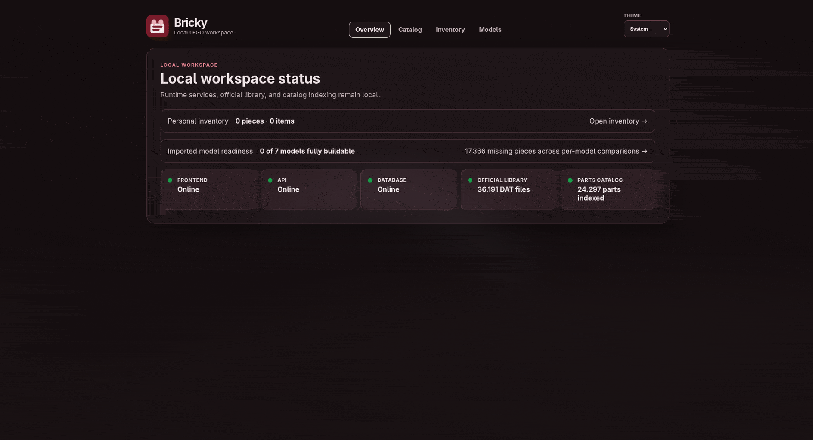
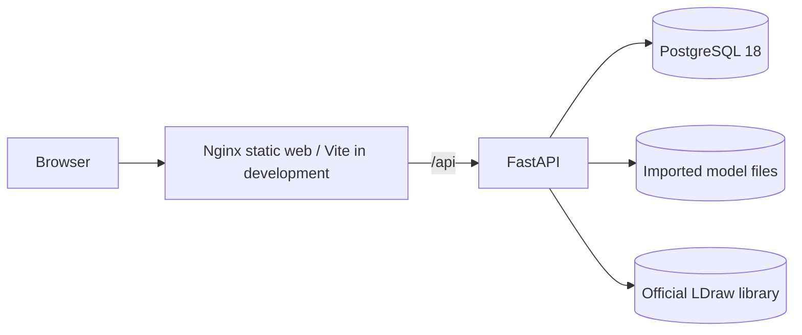

# Bricky

A local-first LEGO parts workspace that imports LDraw models, derives physical bills of materials, tracks personal inventory, and calculates exact build readiness — all offline, no cloud services, no accounts.

<p align="center">
  
</p>

## What it does

- Install and index the official LDraw Parts Library locally in PostgreSQL.
- Import `.ldr`/`.mpd` models with immutable source preservation and recursive MPD resolution.
- Render parts and models in the browser with lazy-loaded Three.js.
- Navigate authored building steps and hierarchical subassembly occurrences.
- Follow visual build steps with highlighted new parts, ghosted context, and guided subassembly tasks.
- Track exact part/color inventory quantities and compare against model BOMs.
- Derive build readiness and missing-parts views per model, live from current inventory.
- Canonicalize validated official LDraw `Moved to` aliases during import.
- Create and restore checksummed local backups of database and imported originals.
- Run a hot-reloading dev stack or a production-like Nginx stack, entirely through Docker Compose.

## Engineering highlights

- Recursive, cycle-aware MPD parsing with deterministic quantity and color propagation.
- Exact canonical part/color BOM comparison and derived missing-parts behavior.
- Immutable source preservation with managed-path serving and deletion.
- Transactional catalog replacement and model/BOM persistence.
- Natural identifiers isolate personal data from rebuildable catalog tables.
- Explicit offline operation with no startup downloads or hidden migrations.
- Lazy-loaded Three.js keeps 3D code out of overview and list route bundles.
- Versioned, checksummed backup/restore with traversal protection.
- Broad automated coverage across parser, filesystem safety, persistence, API, frontend helpers, and operational archives.

## Architecture



Development publishes Vite on `127.0.0.1:5173` and FastAPI on `127.0.0.1:8000`. Production-like mode publishes only Nginx on `127.0.0.1:8080`; API and PostgreSQL remain internal Compose services.

See [`docs/ARCHITECTURE.md`](docs/ARCHITECTURE.md) for service boundaries, storage ownership, data classification, and the multiuser scaling path.

## Technology choices

| Area | Stack | Reason |
|---|---|---|
| Frontend | React 19, strict TypeScript, Vite | Small typed UI with fast local iteration and route-level code splitting. |
| 3D | Three.js, React Three Fiber | Browser-side LDraw rendering without generated GLB assets. |
| API | Python 3.14, FastAPI, Pydantic | Explicit typed HTTP contracts and testable service logic. |
| Persistence | PostgreSQL 18, SQLAlchemy 2, Alembic | Durable relational constraints, transactional rebuild/import behavior, portable dumps. |
| Packaging | Docker Compose, multi-stage images, Nginx | No host runtimes; reproducible development and production-like operation. |
| Quality | Pytest, Vitest, Playwright, axe-core | Backend, API, parser, coverage, frontend helper, E2E, and accessibility checks. |

## Quick start

Docker Engine with Docker Compose is the only host dependency.

```sh
cp .env.example .env              # adjust POSTGRES_PASSWORD, LOCAL_UID/LOCAL_GID on Linux
docker compose up --build          # starts db + api + web with hot reload
```

One-time setup after the first start:

```sh
docker compose run --rm api alembic upgrade head
docker compose run --rm api python -m app.cli.ldraw_library install
docker compose exec api python -m app.cli.ldraw_catalog rebuild
```

Then open <http://127.0.0.1:5173/>.

Full operational details (production-like mode, backups, thumbnails, import behavior) are in [`docs/OPERATIONS.md`](docs/OPERATIONS.md).

## Testing

```sh
./scripts/check.sh    # full gate: lint, types, unit, build, bundle, e2e
```

The same gate runs in CI on every push and pull request. Tests use synthetic fixtures and never touch the installed LDraw library or personal data.

## Documentation

| Document | Description |
|---|---|
| [`docs/OPERATIONS.md`](docs/OPERATIONS.md) | Full setup, runtime, backup, and maintenance instructions. |
| [`docs/ARCHITECTURE.md`](docs/ARCHITECTURE.md) | Service boundaries, storage ownership, import flow, scaling path. |
| [`docs/INSTRUCTION_GRAPH.md`](docs/INSTRUCTION_GRAPH.md) | MPD graph design, hierarchical playback, supported subset, fixtures. |
| [`docs/VISUAL_BUILDER_DESIGN.md`](docs/VISUAL_BUILDER_DESIGN.md) | Visual builder baseline audit, decisions, and acceptance targets. |
| [`docs/VIEWER_STABLE_RELEASE.md`](docs/VIEWER_STABLE_RELEASE.md) | Viewer interaction, browser, and accessibility release gates. |
| [`docs/BULK_INVENTORY.md`](docs/BULK_INVENTORY.md) | Bulk inventory import feature specification. |
| [`docs/DEMO.md`](docs/DEMO.md) | Concise presentation and demo flow. |

## Known limitations

- Single hidden local workspace with no authentication.
- No MOC editing, instruction-PDF conversion, `.io` support, or sibling-file project resolution.
- No part substitutions, alternative-color matching, or inventory consumption between models.
- Large model roots omit child geometry in local canvas mode; enter children through hierarchical navigation.
- Production-like packaging is designed for a trusted local workstation, not public deployment.

## LDraw attribution

This software uses the [LDraw Parts Library](https://www.ldraw.org/). LDraw is a community-run project and is not sponsored, endorsed, or authorized by the LEGO Group. Bricky is not affiliated with LDraw.org or the LEGO Group.

Installed library files retain upstream headers, authors, `CAreadme.txt`, and license notices. Applicable terms include CC BY 2.0, CC BY 4.0, and CC0 content; the installed archive and [LDraw legal information](https://www.ldraw.org/legal-info) are authoritative.

## License

[MIT](LICENSE)
