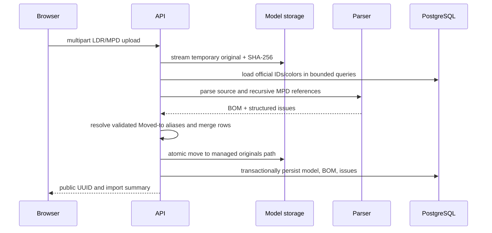

# Bricky architecture

## Service boundaries

- `apps/web` owns navigation, forms, client state, rendering, and production static delivery configuration. It accesses data only through `/api`.
- `apps/api` owns HTTP validation, LDraw installation/indexing, import parsing, coverage calculation, managed files, and operational backup validation.
- PostgreSQL owns durable structured state. Neither browser storage nor the filesystem substitutes for database metadata.
- Nginx is the only production-published service. It serves static assets and proxies API requests.

## Storage ownership

| Storage | Owner | Classification | Recovery |
|---|---|---|---|
| PostgreSQL named volume | PostgreSQL image user | Personal and rebuildable metadata | Restore `database.dump` |
| `data/models` | Configured local UID/GID through API | Personal immutable originals | Included in backup |
| `data/ldraw` | Configured local UID/GID through explicit installer | Rebuildable upstream data | Reinstall and reindex |
| `data/backups` | Configured local UID/GID and host operator | Portable personal-data archives | Copy archive off-device if desired |

No path is made world-writable. PostgreSQL internal files remain in a named volume rather than a host bind mount.

## Database responsibilities

- `parts`, `ldraw_colors`, and `catalog_index_state` are rebuildable catalog metadata.
- `workspaces` contains the deterministic `local-default` workspace boundary.
- `inventory_items` is personal owned quantity keyed by workspace, part ID, and color.
- `imported_models` records immutable source identity, managed location, status, and aggregate counts.
- `model_bom_items` stores derived canonical physical requirements.
- `model_import_issues` stores stable import diagnostics.

Inventory and BOM identifiers intentionally do not cascade from catalog rows. A catalog rebuild can temporarily remove display metadata without deleting personal state.

## Import flow

Source bytes are never normalized. Only derived rows are canonicalized.

## Coverage flow

Coverage loads the selected model BOM and relevant local-workspace inventory in a bounded number of queries. Framework-independent arithmetic calculates available/missing quantities, statuses, and half-up percentages. Catalog/color joins are display metadata only. Reads never reserve or mutate inventory.

Model-list coverage batches requirements and inventory for the page, avoiding one request or inventory query per card. Overview totals are explicitly sums of independent per-model comparisons.

## Deployment topology

Development uses bind-mounted source, Vite hot reload, and Uvicorn reload. Production builds immutable frontend assets and API application code into separate image stages. Nginx, API, and PostgreSQL communicate on the internal Compose network; only Nginx binds to host loopback.

Migrations, LDraw installation, catalog rebuild, backup, and restore remain operator commands. Startup contains no destructive or expensive hidden work.

## Backup boundary

Backup briefly pauses API/web writes, creates a PostgreSQL custom dump, copies immutable model files, writes payload checksums, and atomically publishes one gzip tar archive. LDraw is excluded because it is large and reproducibly reinstallable. Restore validates the complete archive before replacing the database or models.

## Multiuser scaling path

The current API always resolves `local-default`; clients cannot submit workspace IDs. A multiuser version would authenticate first, resolve an authorized workspace server-side, and pass that workspace into the existing inventory/model query boundaries. Database uniqueness already includes workspace ownership where required. Files would need an authorized workspace prefix and storage policy. Visible workspace selection must follow authorization rather than precede it.

At larger scale, model readiness overview aggregation could move from bounded in-memory calculation to SQL aggregates, file storage could use a self-hosted object abstraction, and CPU-heavy parsing/thumbnails could become explicit jobs. None are required for the local MVP.
